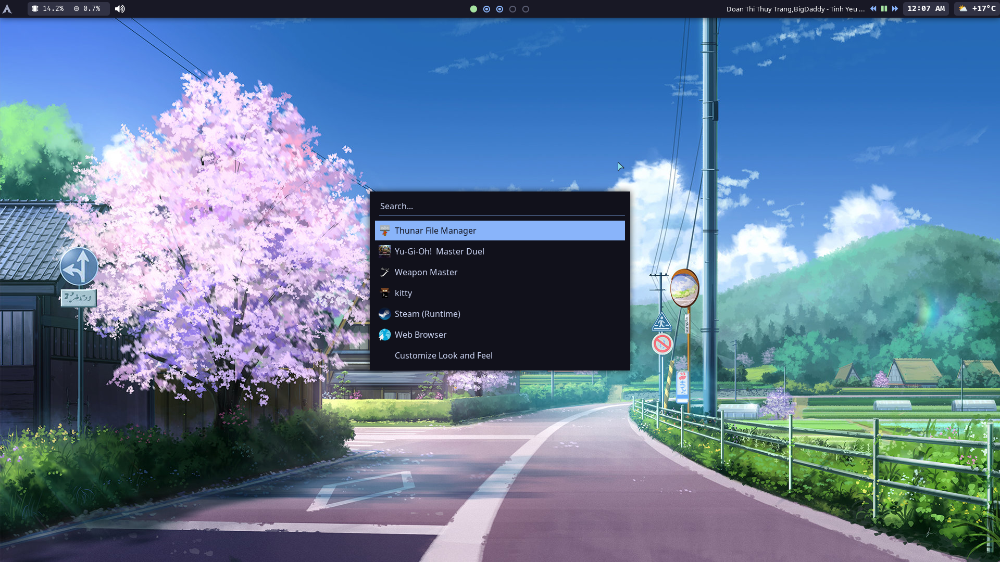
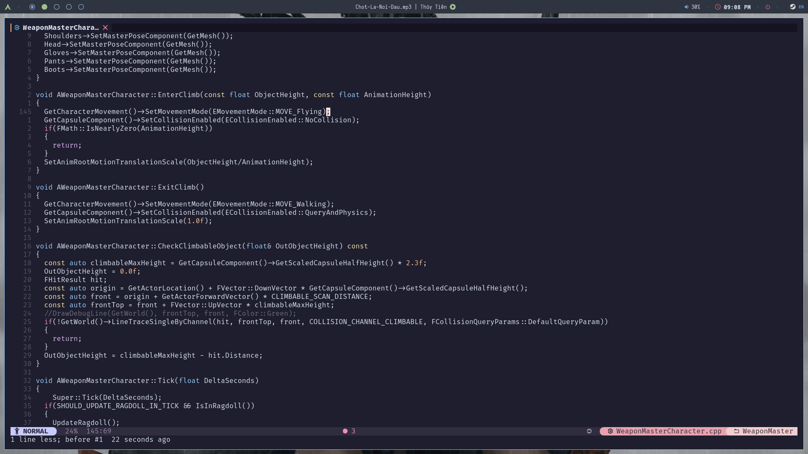
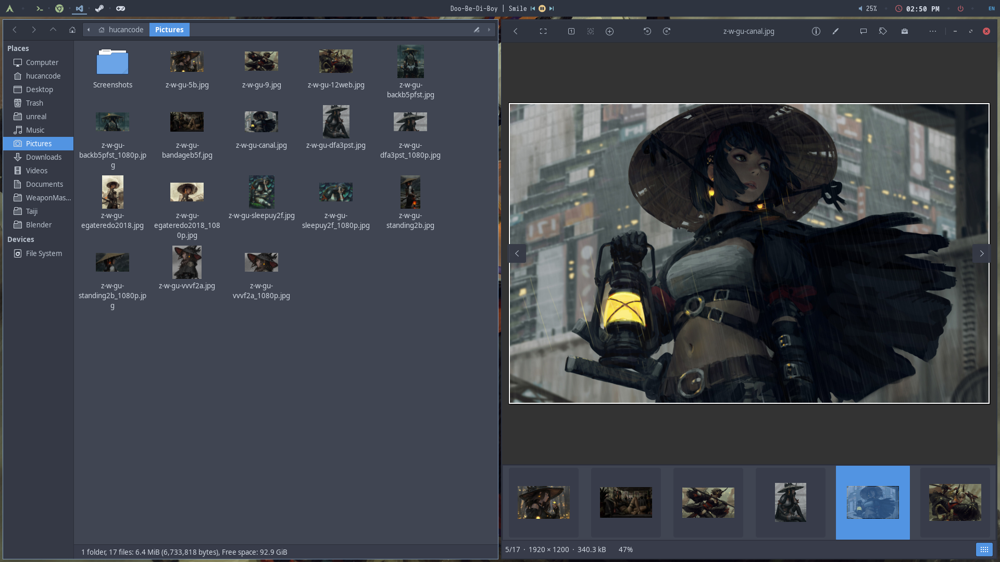
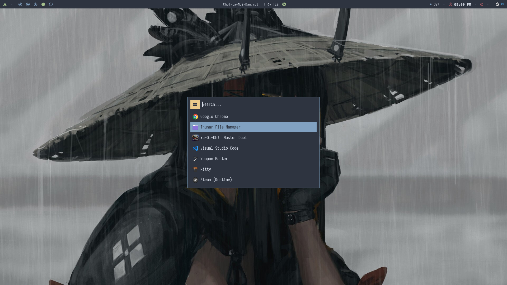
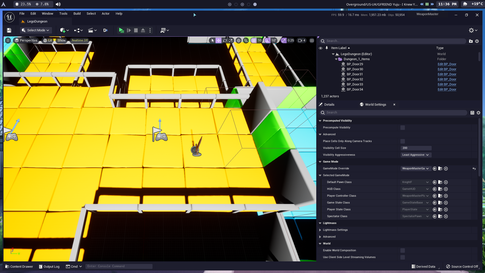

# Hello 👋 

## This is my personal workspace setup

 


## ✨ Features:

- 📦 Window manager [openbox](https://wiki.archlinux.org/title/openbox)
- 🔑 Display manager (the login thing) [lightdm](https://wiki.archlinux.org/title/lightdm)
- 📊 Status bar [eww](https://github.com/elkowar/eww)
- 🚀 Program launcher [rofi](https://wiki.archlinux.org/title/rofi)
- 🔔 Notification panel [dunst](https://wiki.archlinux.org/title/dunst)
- 📂 File manager [joshuto](https://github.com/kamiyaa/joshuto) and [thunar](https://docs.xfce.org/xfce/thunar/start)
- 📋 Text editor [helix](https://helix-editor.com/) and [mousepad](https://docs.xfce.org/apps/mousepad/start)
- 💻 Shell and terminal emulator [fish](https://wiki.archlinux.org/title/fish), [tmux](https://github.com/tmux/tmux), [alacritty](https://alacritty.org/)
- 🎧 Music player [mpd](https://wiki.archlinux.org/title/Music_Player_Daemon) and [ario](https://ario-player.sourceforge.net/)

# 👀 Screenshots







# 🚀 Installation

## 🐌 Arch Linux

This script will check out my git repo at your home directory and install all software
```bash
curl https://raw.githubusercontent.com/hucancode/home/main/rice.sh | sh
```
Or install only cli tool with this (useful if you are on WSL)
```bash
curl https://raw.githubusercontent.com/hucancode/home/main/rice-cli.sh | sh
```

## 🐌 Other distro

Please find equivalent of these packages on your system
```
lightdm lightdm-gtk-greeter lightdm-gtk-greeter-settings arc-gtk-theme
ttf-fira-code noto-fonts noto-fonts-cjk noto-fonts-emoji
openbox rofi yad dunst nitrogen xclip xdotool maim
i3lock-color eww ksuperkey firefox thunar joshuto
alacritty helix exa git-delta rustup nodejs npm
```

## 🐚 After install

You may want to change your default shell to `fish`
```bash
chsh -s /usr/bin/fish
```
