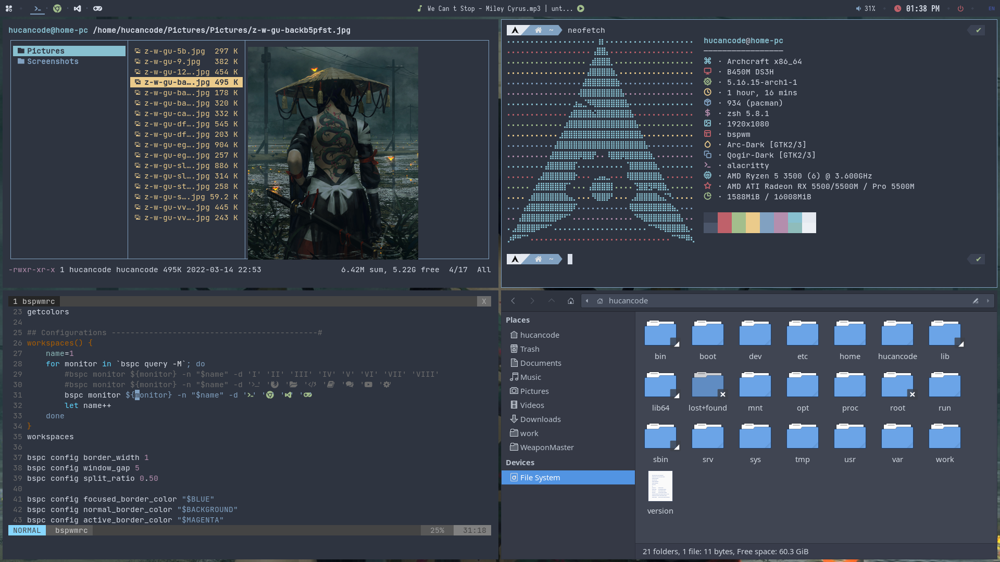
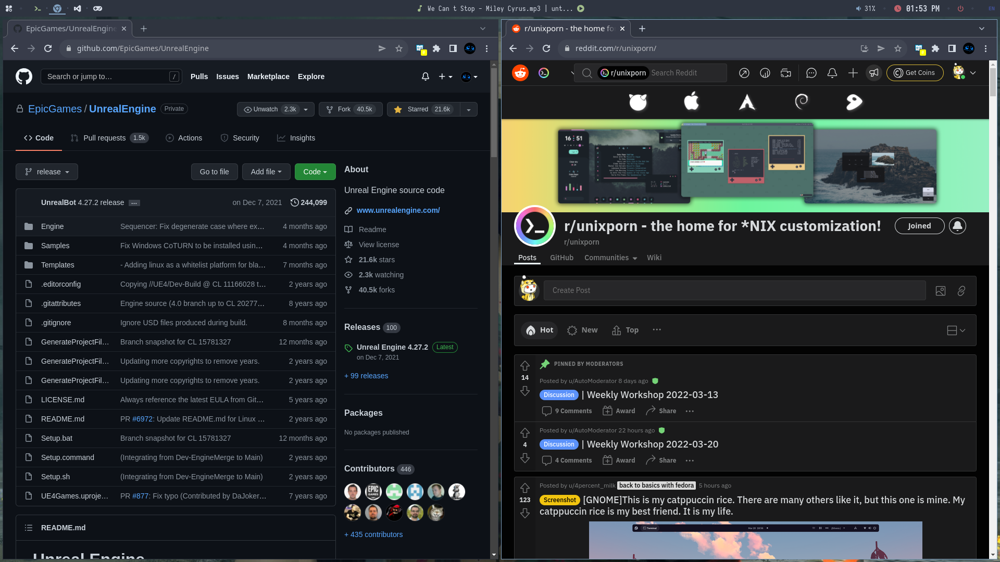
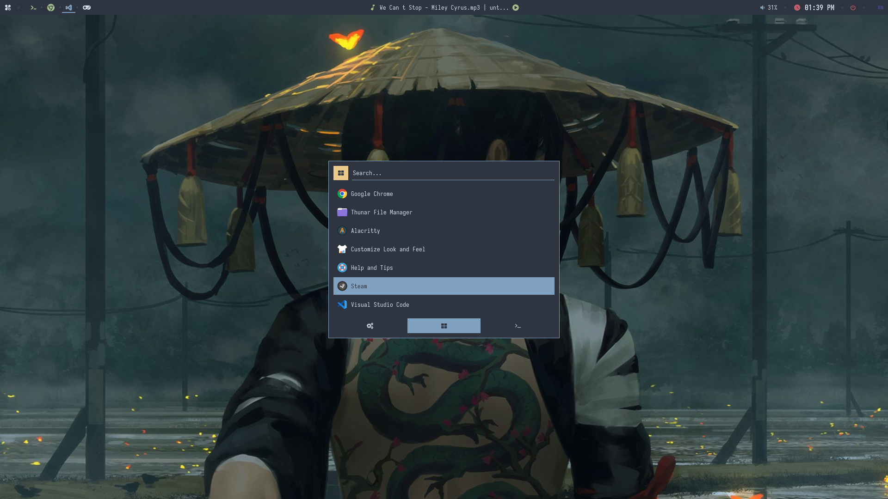
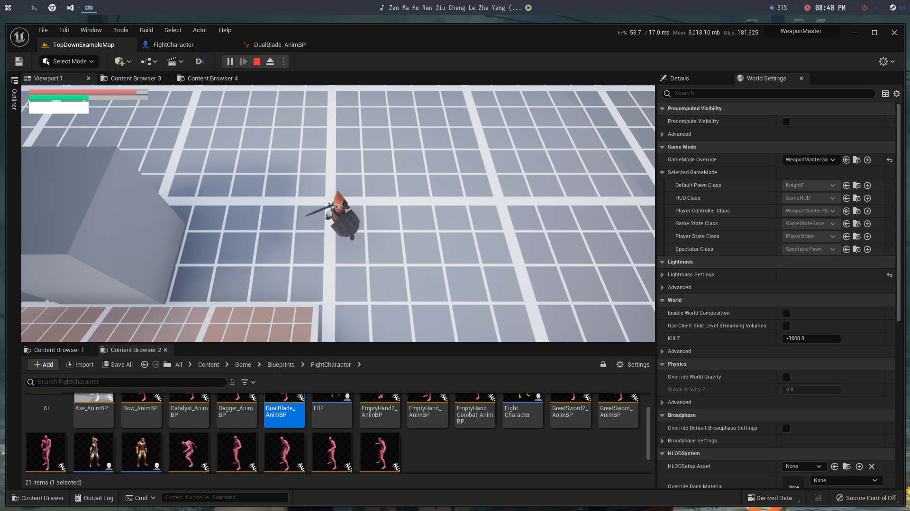

# Hello 👋
This is my personal ricing setup. Powered by [Arch](https://archlinux.org/). Heavily influenced by [Archcraft](https://archcraft.io/).
<details>
  <summary> What is ricing? </summary>
   
    The term ‘rice’ is used to describe a person’s unix desktop where ‘ricing’ is when someone is custom their desktop such as the icons, panels, or system interface. When it comes to ricing a tiling window manager though, the ricing of a user’s system becomes much more involved. Basic things such as the panel bar and application launcher must be configured by the user.
    The reddit community /r/unixporn is a great place to stay up to date on what people are using for their setups.
    // by [thatnixguy](https://thatnixguy.github.io/)
</details>

## Contain settings for:
- Window manager, [bspwm](https://wiki.archlinux.org/title/bspwm), [sxhkd](https://wiki.archlinux.org/title/sxhkd). `bspwm` is pretty harsh, if something went wrong you are welcomed with a black screen and no mouse/keyboard input. In case `bspwm` didn't work or you just don't like a tiling window manager, login with [Openbox](https://wiki.archlinux.org/title/openbox)
- Status bar. [polybar](https://wiki.archlinux.org/title/polybar)
- Program launcher [rofi](https://wiki.archlinux.org/title/rofi)
- Notification panel [dunst](https://wiki.archlinux.org/title/dunst)
- File manager [thunar](https://wiki.archlinux.org/title/thunar)
- Loved by many, hated by some, known to all text editor [vim](https://wiki.archlinux.org/title/vim)
- Terminal emulator [ZSH](https://wiki.archlinux.org/title/zsh), [Alacritty](https://wiki.archlinux.org/title/alacritty)
- Music player [mpd](https://www.musicpd.org/)
# Screenshots




# Installation
## Install Arch
Assume that you use `archinstall`.
These packages below should be installed during arch installation (When it asks you to `arch-chroot` into your new disk, please accept). If you don't want to install everything right now, at least install `dhcpcd` and `vim` to make sure we have internet and a debug tool after reboot.
```
sudo pacman -S dhcpcd vim git \
    lightdm lightdm-gtk-greeter lightdm-gtk-greeter-settings arc-gtk-theme \
    bspwm sxhkd openbox rofi dunst xsettingsd xdg-user-dirs nitrogen xclip \ 
    maim ffmpeg ffmpegthumbnailer \
    mpd mpc ncmpcpp mpv \
    thunar thunar-volman xarchiver thunar-archive-plugin ranger ueberzug \
    alacritty zsh \
    ttf-jetbrains-mono noto-fonts noto-fonts-cjk noto-fonts-emoji \
    gnome-keyring libgnome-keyring;
```
## Install `yay`
```
git clone https://aur.archlinux.org/yay-bin.git; cd yay-bin; makepkg -si;
```
## Use `yay` to install what's missing
```
yay -S polybar ksuperkey qogir-icon-theme vimix-cursors i3lock-color \
    google-chrome ttf-iosevka zsh-theme-powerlevel10k-git;
```
Additionally I need some more packages, you can skip this if you don't want them.
```
sudo pacman -S ibus-anthy docker mono steam;
yay -Sy visual-studio-code-bin ibus-bamboo megacmd;
echo $'\n# Settings for Japanese input\nexport GTK_IM_MODULE=QT_IM_MODULE=XMODIFIERS=@im=\'ibus\'\n# Toolbar for ibus\nibus-daemon -drx' >> ~/.xprofile
```
## Change default shell to zsh
```
chsh -s $(which zsh)
```
## Checkout rice configurations, move everything to `~`
```
git clone https://github.com/hucancode/dotfiles
cd dotfiles; cp . ~;
```
You may want to clean some git things after that
```
cd ~; rm -r .git .gitignore README.md screenshots;
```
Then copy avatar and wallpaper to somewhere `lightdm` have access to.
```
cp {avatar.jpeg,wallpaper.jpg} /usr/share/lightdm-gtk-greeter-settings
```
You can alternatively put those picture at `~` and give `lightdm` access to your `~` folder
## Config `lightdm`
Set `lightdm` as your default display manager.
```
systemctl enable lightdm;
```
Enable `lightdm-gtk-greeter` (`lightdm` default to gtk greeter, but just in case something went wrong, please check `lightdm.conf`)
```
vim /etc/lightdm/lightdm.conf
# enable [Seat:*]
# ...
# greeter-session=lightdm-gtk-greeter
# ...
```
Rice your greeter with this
```
lightdm-gtk-greeter-settings
# select theme, wallpaper, avatar
```
This is how `/etc/lightdm/lightdm-gtk-greeter.conf` should looks like after configuration. Alternatively you can skip GUI setting program and straight up copy this.
```
[greeter]
background = /usr/share/lightdm-gtk-greeter-settings/wallpaper.jpg
default-user-image = /usr/share/lightdm-gtk-greeter-settings/avatar.jpeg
theme-name = Arc-Dark
icon-theme-name = Qogir-dark
indicators = ~spacer;~clock;~spacer;~session;~power
```
## Config `mpd`
Assume that `mpd` is running safe and sound, if not, check for `~/.config/mpd/mpd.conf`. My configuration looks like this:
```
pid_file "~/.config/mpd/mpd.pid"
state_file "~/.config/mpd/mpdstate"
db_file "~/.config/mpd/database"
music_directory "~/Music"
playlist_directory "~/.config/mpd/playlists"

audio_output {
    type  "pipewire"
    name  "PipeWire Sound Server"
}
```
Open `ncmpcpp` and edit your playlist
```
ncmpcpp
# press 2 to open browse
# select your folder and press A to add all songs in that folder to playelist
# or press 4 to open library
# press space to add current song to playlist
```
