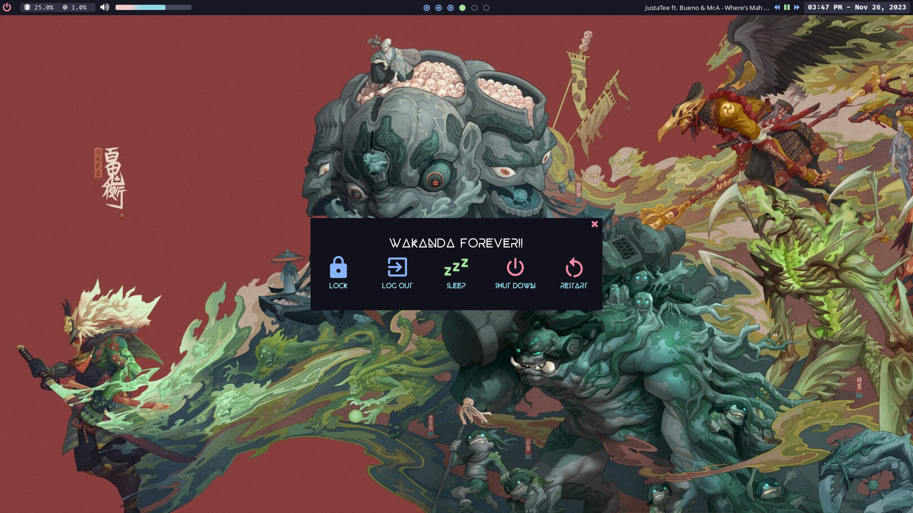

# Hello 👋 

## This is my personal workspace setup

 


## ✨ Features:

- 📦 Window manager [hyprland](https://github.com/hyprwm/Hyprland)
- 🔑 Display manager (the login thing) [sddm](https://wiki.archlinux.org/title/SDDM)
- 📊 Status bar [eww](https://github.com/elkowar/eww)
- 🚀 Program launcher [ulauncher](https://ulauncher.io)
- 📂 File manager [joshuto](https://github.com/kamiyaa/joshuto)
- 📋 Text editor [helix](https://helix-editor.com/)
- 💻 Shell and terminal emulator [fish](https://wiki.archlinux.org/title/fish), [alacritty](https://alacritty.org/)
- 🎧 Music player [mpd](https://wiki.archlinux.org/title/Music_Player_Daemon) and [ario](https://ario-player.sourceforge.net/)

# 👀 Screenshots




# 🚀 Installation

## 🐌 Arch Linux

This script will check out my git repo at your home directory and install all software
```bash
curl https://raw.githubusercontent.com/hucancode/home/main/rice.sh | sh
```
Or install only cli tool with this (useful if you are on WSL)
```bash
curl https://raw.githubusercontent.com/hucancode/home/main/rice-cli.sh | sh
```

## 🐌 Other distro

Please find equivalent of these packages on your system
```
sddm arc-gtk-theme
ttf-fira-code noto-fonts noto-fonts-cjk noto-fonts-emoji
hyprland hyprpaper ulauncher mako grim slurp wl-clipboard
eww-wayland firefox joshuto
alacritty helix exa git-delta
```

## 🐚 After install

You may want to change your default shell to `fish`
```bash
chsh -s /usr/bin/fish
```

## Shortcuts
### Application launcher
```
Super + Enter - Open terminal emulator
Super + W - Open browser
Super + X - Power menu
Super + R - Run
```
### Screenshot
```
Print Screen - Screenshot (Screen)
Alt + Print Screen - Screenshot (Window)
Super + S - Screenshot (Region)
```
### Window management
```
Super + Q - Close window
Super + Up/Down/Left/Right - Move window
Super + Left mouse - Move window
Super + Right mouse - Resize window
Super + 1/2/3/4/5/6 - Switch workspace 1~6
Super + Tab - Toggle scratch workspace
Super + Shift + 1/2/3/4/5/6 - Move window to workspace 1~6
Super + Shift + Tab - Move window to scratch workspace
Super + Space - Toggle window floating
Alt + Tab - Cycle window focus
Alt + Shift + Tab - Cycle window focus backward
```
